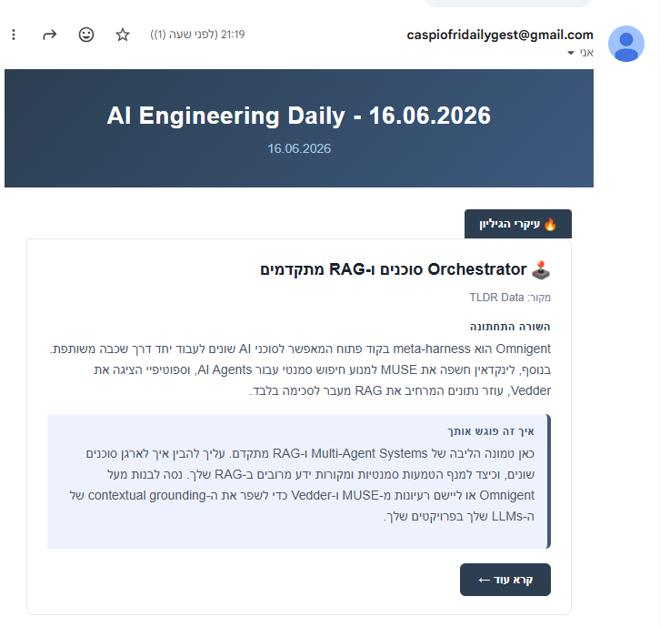
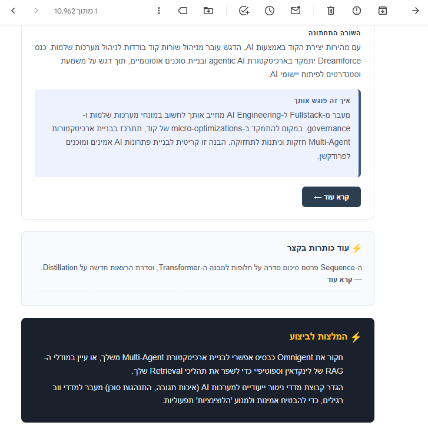
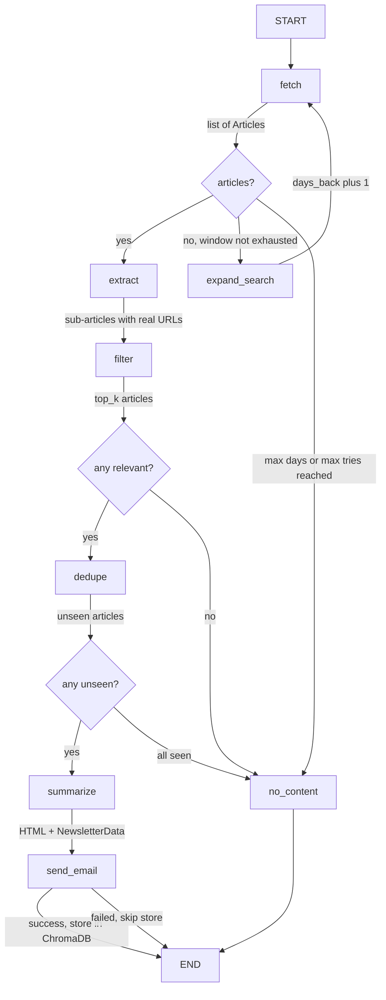

# Newsletter Agent

An end-to-end AI pipeline that reads your Gmail newsletters, selects the most relevant articles with an LLM, writes a personalized Hebrew digest, and delivers it to your inbox — fully automated, daily.

Built with LangGraph, Google Gemini 2.5, and a multi-criteria LLM-as-judge eval harness.

---

## Demo

| Top of digest | Full issue |
|---|---|
|  |  |

---

## Architecture

The pipeline is a **stateful LangGraph graph** with a conditional retry loop. Two independent knobs control the loop: `max_days_back` (how far back in time to search) and `max_tries` (transient failure retries). If neither limit is reached and no articles are found, the graph widens the search window by one day and retries.



### Node responsibilities

| Node | What it does |
|---|---|
| `fetch` | Gmail API → decode MIME parts → `list[Article]` (one per email) |
| `extract` | Parallel Gemini calls — explodes each email into individual sub-articles with real URLs |
| `expand_search` | Widens the search window (`days_back + 1`) when no emails found |
| `filter` | Gemini scores all article titles by subject relevance, returns top-k names |
| `dedupe` | ChromaDB vector search — drops articles seen within the last 3 days |
| `summarize` | Gemini writes full newsletter JSON → rendered to HTML |
| `send_email` | Gmail API sends the HTML digest; stores articles in ChromaDB only on success |
| `no_content` | Terminal node when no sendable articles exist |

---

## Newsletter structure

Each digest is compiled into three sections by the LLM:

- **עיקרי הגיליון** (Top stories) — articles scoring ≥ 6/10 relevance. Each card has:
  - *השורה התחתונה* — 1–2 sentence factual summary, no fluff
  - *איך זה פוגש אותך* — personalized angle connecting to the reader's stack (RAG, LangGraph, multi-agent)
- **עוד כותרות בקצר** (Brief) — lower-relevance articles as one-liners
- **המלצות לביצוע** (Actions) — 1–2 specific, executable recommendations grounded in today's articles

The LLM is given a structured output schema (Pydantic → JSON) so the HTML renderer never touches raw prose.

---

## Eval harness

`eval.py` runs three nodes against fixture data — **no Gmail required** — and produces a quality report.

**Fixture set:** 6 AI-engineering articles + 2 deliberately off-topic (startup funding, health study) to test filter discrimination.

### Structural checks (rule-based)

| Check | What fails it |
|---|---|
| HTML parseable | BeautifulSoup parse error |
| has header | `.header` class missing |
| has full card | no `.card` element |
| has brief section | no `.brief-section` element |
| has actions section | no `.actions-section` element |
| no `dir=ltr` elements | RTL layout broken |

### LLM-as-judge scores (1–5 each)

| Criterion | Rubric |
|---|---|
| **Faithfulness** | Every factual claim traceable to source articles; no hallucination |
| **Hebrew quality** | Fluent prose; technical terms (RAG, LLM, API) kept in English |
| **Personalization** | Advice is concrete and specific to the target audience's stack |
| **Actionability** | 1–2 immediately executable actions tied to today's articles |

The third eval suite covers the `dedupe` node — four cases: empty store passes all, seen articles are blocked, genuinely new articles pass through, and mixed batches return only the unseen subset.

Run it:

```bash
python eval.py
# Results printed as a table and saved to logs/eval_<timestamp>.json
```

---

## Reliability

Every Gemini call is wrapped in **tenacity** — 3 retries with exponential backoff (2 s → 4 s → 8 s). The full graph execution runs inside a **600-second asyncio timeout** so a hanging API call never blocks the daily run.

---

## Tech stack

| Layer | Choice | Why |
|---|---|---|
| Orchestration | LangGraph | Stateful graph with first-class conditional edges and checkpointing |
| LLM | Gemini 2.5 Flash | Extended thinking budget for the summarize step; cost-effective for daily runs |
| Email | Gmail API (OAuth 2.0) | Native read + send from an existing inbox, no extra infra |
| Data modeling | Pydantic | Structured LLM output that fails loudly on schema violations |
| Deduplication | ChromaDB + sentence-transformers | Vector similarity dedupe prevents resending articles seen in the last 3 days |
| Fault tolerance | tenacity + asyncio timeout | Handles transient LLM failures without manual intervention |

---

## Setup

### Prerequisites

- Python 3.10+
- Google Cloud project with Gmail API enabled
- `credentials.json` (OAuth 2.0 Desktop App) from the Cloud Console
- Gemini API key

### Install

```bash
pip install -r requirements.txt
```

### Configure

Copy `.env.example` and fill in your values:

```bash
cp .env.example .env
```

### First run — Gmail auth

The first run opens a browser for OAuth consent and saves `token.json` for subsequent runs.

```bash
python main.py
```

---

## Project structure

```
├── main.py            # Entry point — invokes the compiled graph
├── graph.py           # LangGraph node wiring and conditional edges
├── nodes.py           # Node implementations (fetch, filter, dedupe, summarize, send)
├── state.py           # DigestState TypedDict — shared across all nodes
├── models.py          # Article, ArticleCard, NewsletterData Pydantic models
├── gmail_client.py    # Gmail API wrapper (auth, read, send)
├── article_store.py   # ChromaDB vector store — deduplication and article retention
├── trace_judge.py     # Per-run LLM-as-judge with 3-stage scoring
├── eval.py            # Offline eval harness — no Gmail needed
└── requirements.txt
```
